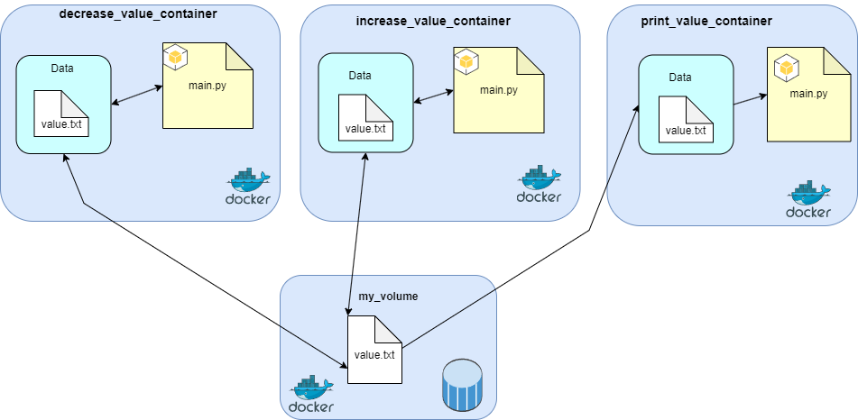

# Containerlar Arası Veri Paylaşımı

Bu proje, üç ayrı Docker container arasında veri paylaşımını anlamak amacıyla oluşturulmuştur. Tüm container'lar, tek bir volume'a bağlı olan `value.txt` adlı dosyayı  kullanır. 

Projenin adım adım daha detaylı açıklandığı Medium makalesine [link](https://github.com/UmutSahin0/shared_data_with_volume_for_multiple_containers) aracılığı ile ulaşabilirsiniz.

## Mimari

## Containerlar

### 1. increase_value_container
- **Görev:** .txt dosyasından değeri okur, +1 ekler ve sonucu tekrar .txt dosyasına yazar.
- **Kullanım:** Mevcut değeri artırarak günceller.

### 2. decrease_value_container
- **Görev:** .txt dosyasından değeri okur, -1 çıkarır ve sonucu tekrar .txt dosyasına yazar.
- **Kullanım:** Mevcut değeri azaltarak günceller.

### 3. print_value_container
- **Görev:** .txt dosyası mevcut değilse oluşturup ilk değer (100) atamasını yapıp metin belgesini kaydeder ve .txt dosyasındaki değeri okuyup terminale yazdırır.
- **Kullanım:** Veri değişimlerini gözlemlemek ve .txt dosyasının zero-shot için oluşturulması amacıyla kullanılır.

## Kullanım Talimatları

### Container'ları Başlatma ve Docker Volume Oluşturma
Her şeyi kurulu bir şekilde hazır hale getirmek için `initialize_docker.bat` dosyasını çalıştırın. .bat dosyası çalıştırıldıktan sonra volume, container'lar ve image'lar oluşturulmuş olacak. 

Ardından `print_value_container` adlı container'ı çalıştırın. İlk çalıştırmada `value.txt` adlı metin belgesini oluşturacak ve ilk değeri ekrana yazdıracaktır.

### Değişiklikleri Gözlemleme
Buraya kadarki işlemleri hallettikten sonra değer arttırma ve değer azaltma işlevlerine ait container'ları istediğiniz sıra ile çalıştırabilirsiniz. Her bir adımda `print_value_container`'ı çalıştırarakta `value.txt` dosyasındaki değerin güncellemelerini terminalde görebilirsiniz.

## Notlar
- Container'lar arası veri paylaşımı, aynı volume'u kullanarak sağlanır.
- Proje, Docker'ın veri paylaşım özelliklerini öğrenmek ve öğretmek amacıyla geliştirilmiştir.

## Lisans

Bu proje [MIT Lisansı](https://opensource.org/licenses/MIT) altında lisanslanmıştır. Detaylar için yukarıdaki bağlantıya göz atabilirsiniz.